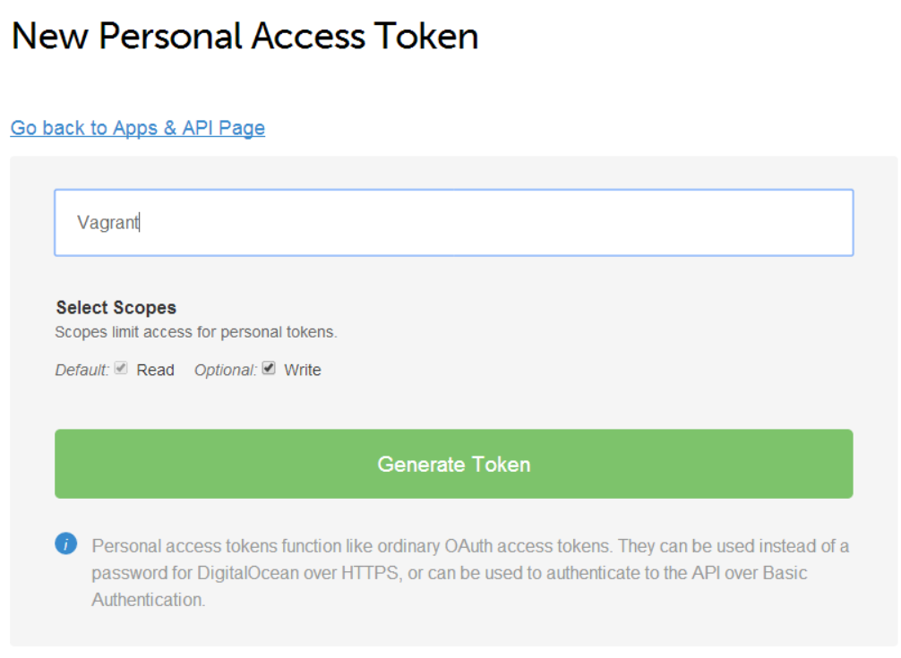

# Cloud Servers

"The Cloud" such a trendy term these days, but don't let the trendiness fool you, there is a lot of power in the cloud.  You get an API to manage your servers and in some cases associated services.  You get to pay by the hour with no long term contracts (in most cases).  You get great pricing on a basic server from providers like Digital Ocean.

The **most important features** of cloud hosting are API control and hourly pricing.  Having an API to create and destroy servers allows you to treat hardware as code and control it with configuration.  Hourly pricing lets you spin up servers to run tests, to demo applications to clients, or as short term dev environments.  You can turn servers on as you need them and turn them off when you don't.

Even if the cloud isn't the right fit for every project, its easy to see how a $10 a month server with API control can be the right fit for testing and staging environments.  It might even make sense to use it for development rather then buying more hardware for all the VM's you find yourself running.

Lets set one up at Digital Ocean so our next tutorial on deployment has a destination.

## Tutorial
If you remember back to the *Development Environments* chapter the PuPHPet ui had options to deploy to the cloud.  This makes things super simple, we can quickly replicate our local vagrant server at Digital Ocean.

**Vagrant + DO is a bit of mess right now, I cover the fixups, but things could be better**

**TODO figure out if there is a better solution, maybe explain how to use a different tool + PuPHPet's puppet config**

**With the no Rsync installed by vagrant on Windows i'm tempted to rewrite this chapter, things don't seem to be a globally usable state right now**

If you are running windows, install [MinGW](http://sourceforge.net/projects/mingw/files/latest/download) then install msys rsync and run vagrant from the Git Shell that the github client installs.  This will give you rsync.

1. [Signup](https://www.digitalocean.com/?refcode=b7452ac8079b)
2. Generate a new PuPHpet config with Digital Ocean as the target
 * You can drag and drop your current config.yaml so you only have to change the target
 * As of 7/13/2014 the vagrant digital ocean provider uses the 2.0 api.  PuPHPet is still asking for 1.0 config as of 7/16/2014.  You will need to edit the config.yaml to fix this.
 * Local Private Key Path needs to be set to real key, if you don't already have a default ssh key you can generate a new one by running "ssh-keygen"
 * 1GB/1 CPU boxes are $10 a month 512MB are $5 a month
4. Set provider.token in the config.yaml where you see api_key, you can get a token from Apps & Api in the Digital Ocean control panel.  Also change the region to "nyc2".

You also need to add the follow to the VagrantFile in the "config.vm.provider :digital_ocean do |provider|" section
```
    provider.token = "#{data['vm']['provider']['digital_ocean']['token']}"
```
3. Run "vagrant destroy" if you currently have a local vm from the earlier chapters.  Vagrant can currently only manage vm's from provider type
4. Backup your local puphpet file "mv puphet puphet-local"
5. Copy the new puphet config
6. Folow the Digital Ocean Instructions from puphpet
```
vagrant plugin install vagrant-digitalocean
vagrant box add dummy https://github.com/smdahlen/vagrant-digitalocean/raw/master/box/digital_ocean.box
```
7. Run "vagrant up"
8. Run ""


## Vagrant + Cloud
The vagrant experience isn't perfect switching between local and remote VMs.  For most dev uses, either or will work.  Also remember that as long as you aren't customizing your VMs outside of the puphpet config they are 100% reproducable so destroying them isn't an issue.

For more complex situations its easy enough to control Digital Ocean servers with your own code or one of the [community tools](https://www.digitalocean.com/community/projects).  You can even reuse the puppet configuration from PuPHPet.  These more complex situations are left up to the exercise of the reader.
