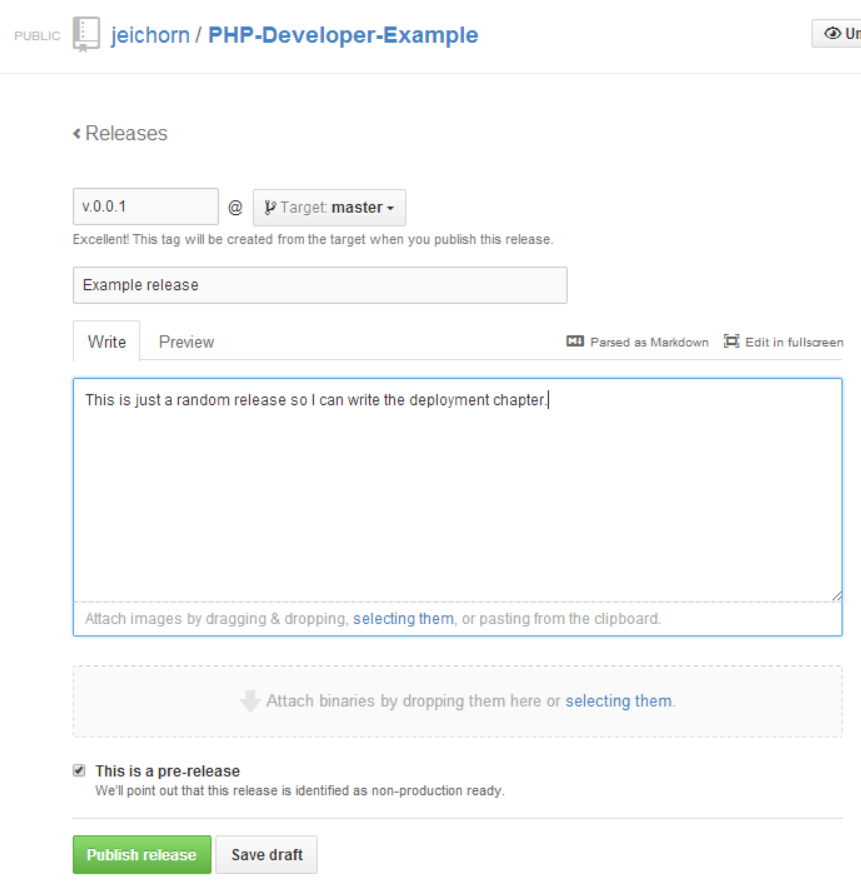
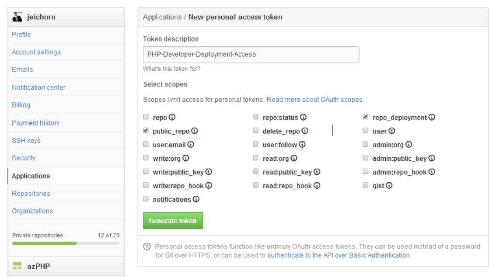

# Deployment

So you have source control, a development environment, and a server running in the cloud.  The next step is to close the loop and deploy code.  If you are using a framework like Symfony or Laravel you will likely want to start with the tooling that they provide (this is especially useful for database changes since they provide support for managing this).  In our case, this is a small standalone PHP project so we can get away with a simple solution.  Its generally a good idea to start simple, feel some pain and then look for tools to solve the problems you are having.  Deploying tends to vary from app to app so it better to find pain points and solve them then imagine pain points and try to solve everything.

## Tutorial
Our project is hosted at github: https://github.com/jeichorn/PHP-Developer-Example.  We use composer for dependencies, so we need to update them.  We don't have to worry about a database.

1. Create a new release using the Github website.

2. Create a personal access token https://github.com/settings/tokens/new, that way we can have a roll user for deployment access.  (Make sure to copy the token right away, once you reload the page its gone.)

3. Take a look puphpet-user/deploy.php
 * It uses the github api to find the newest deploy
 * Pre-Releases can be ignored based on config
 * It goes to our configured releases dir
 * Runs ```git fetch```
 * Then it runs ```git checkout $tag``` to switch to our release
 * Then it runs ```composer install``` to get the newest dependencies specified by the lock file
 * Writes out a log entry
 * Emails the user specified in the config, (leave this off by default, since you are unlikely to be able to send email directly from Digital Ocean since all there ips are maked as spam sources.  You can use [Madrill](https://mandrill.com/signup/) for free for up to 12k emails a month, and its a great solution to this problem.
4. Create puphpet-user/deploy-config.php
 ```php
<?php
return [
  'github-user' => 'jeichorn',
  'github-repo' => 'PHP-Developer-Example',
  'token' => 'XXXXXXXXXXXXXXXXXXXXXXXXXXX',
  'deploy-dir' => '/var/www/',
  'no-pre-release' => false,
  'email' => false,
];
```
5. Take a look at puphpet-user/deploy.pp
 * It creates a web-deploy user
 * Add a cronjob to run deploy.php every minute
 * It copies over deploy.php and deploy-config.php
 * It adds some packages we need to work
 * Its kicked off by a script in puphpet-user/files/exec-always/
6. Run ```php DigitalOcean\create-server.php go``` It will push your updated config
7. Wait 1 minute the check the log at /home/web-deploy/deploy-YYYYMMDD.log
8. Once you've seen a deploy load the site in your web browser, you should see ```Hello World``` now.
9. Make some changes to the webapp (see the awesome dir) do another release and watch it be deployed.

We used a lot of tooling in this tutorial, building off puppet and some customization functionality baked into the simple create-server.php script.  We could have just written a shell script instead of using puppet, but it would have been a lot more code to write.  We could have also kicked off this extra job in a simpler fashion ```scp script.sh root@server:``` ```ssh root@server script.sh```, but the create-server.php is trying to mimic the PuPHPet setup since its using most of its code to setup the server.

## Use the right tool for the job
Git based deployment is great for staging, testing, and production, but its not the solution if you want to do remote development.  In a case like that either use an editor that runs on the server like vim, an editor with transparent sftp support, or rsync.  There are even tools (or you can write a quick script to do it yourself) that watch for changed files and use rsync to update those changes.
