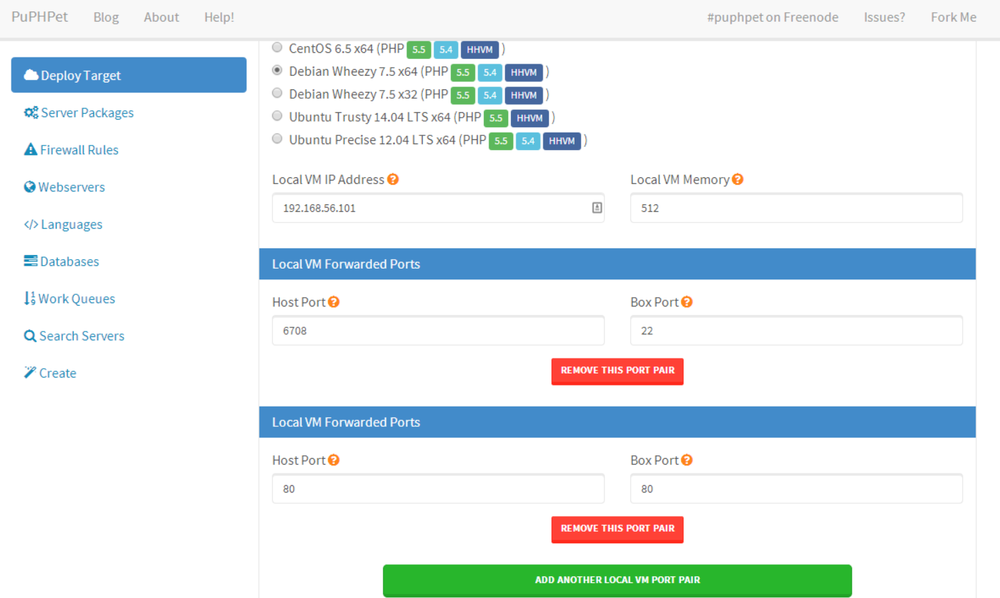
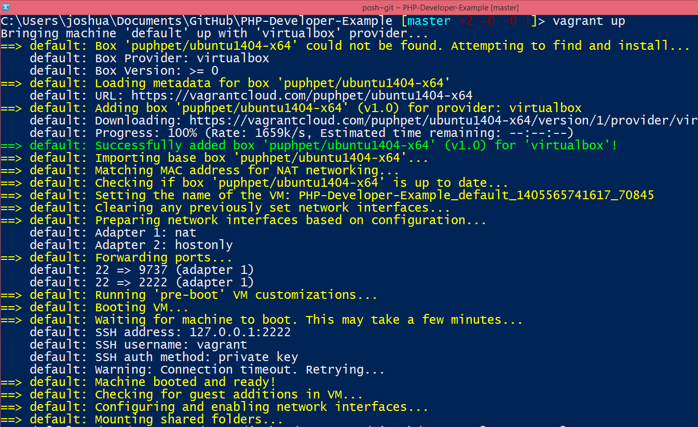
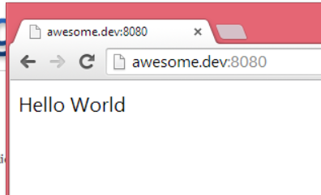
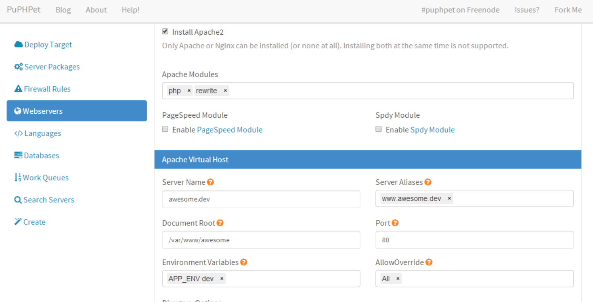
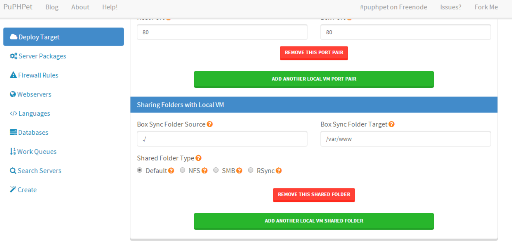

# Development Environments
A couple years ago the height of a development environment was a fancy IDE and a php/mysql/apache installer like [Wamp](http://www.wampserver.com/en/).  Today there are a lot better options.  Virtual machines give you the ability have multiple pristine environment that can exactly match your production environment.  They give you the ability to try out new versions of PHP or Mysql and easily rollback, and they let you work on multiple projects with different PHP requirements at the same time.  They also save you from spending hours setting up a dev environment by hand, or day's fixing things after everything has blow up.

The core of this functionality is provided by 2 projects:
* [Virtualbox](https://www.virtualbox.org/) - a free virtualization product
* [Vagrant](http://www.vagrantup.com/) - a vm manger with built in support for virtualbox

With just these basics you can install a linux distro that matches your dev servers, clone it and get to a fairly reproducable state, but we can do better.

There are many configuration mangement tools out there, these allow you to automate the installation and configuration of a VM (or any other server).  Luckily we don't have to learn one to get its advantages for a basic dev environment.  There are projects like [PuPHPet](https://puphpet.com/) which combine the vargrant configuration with a puppet configuration to give you a configurable full blown development environment.

## Tutorial

1. Install Virtualbox
2. Install Vargrant
3. Go to https://puphpet.com/
4. Create a config for a local install of Ubuntu Trusty 14.04 with PHP 5.5, you can leave the defaults for everything else
5. Add a port forward of local 80 to box 80

6. Create the config
7. Unzip the generated zip
8. Move the contents to the directory of the project you are working on
9. Open a shell, change to the phuphept dir run "vagrant up"

10. Wait... vagrant will download a base ubuntu image, boot it, then puppet will run and configure it with the dev environment you picked
11. Run "vagrant ssh" check out your new server then run "exit"
12. Add an awesome.dev entry to your /etc/hosts file that points to 127.0.0.1
13. Add a index.php file to the awesome directory
```php
<?php
echo "Hello World";
```
14. Open awesome.dev in your browser, enjoy your hello world

15. When you are done run "vagrant halt" to turn off the box

## So whats going on?
In the default phuphet config there is an awesome.dev vhost, its points to /var/www/awesome.

The directory you run "vagrant up" in is configured to be exported to /var/www on the virtual machine that vargrant sets up.

With this setup you can edit local with your favorite IDE, and check out your changes in the PHP install on the VM.

## What Next
You might want to check out the puphpet/config.yaml file, its what is being generated by the website.  You can upload it to the site to have it generate a new version or just edit it manually, its pretty stright forward.

## Are you on Windows?
You likely will want a nice ssh client, a great choice is [putty](http://www.chiark.greenend.org.uk/~sgtatham/putty/download.html).  It includes an agent as well which allows you to unlock password protected keys once per session.

Want a graphical editor for your hosts file, try [HostsMan](http://www.abelhadigital.com/hostsman)


## Things to checkout
You might want to dig into the "Sharing Folder with Local VM" section on the "Deploay Target" tab and Vhost section on the "Webservers" tab.  A basic export of your project to /var/www works, but likely isn't what you want long term.
