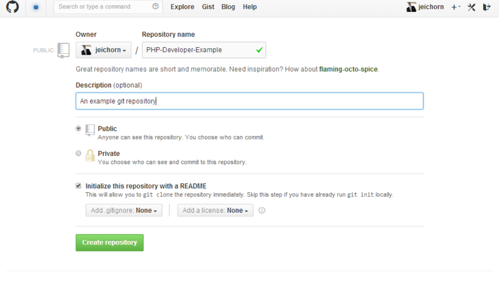
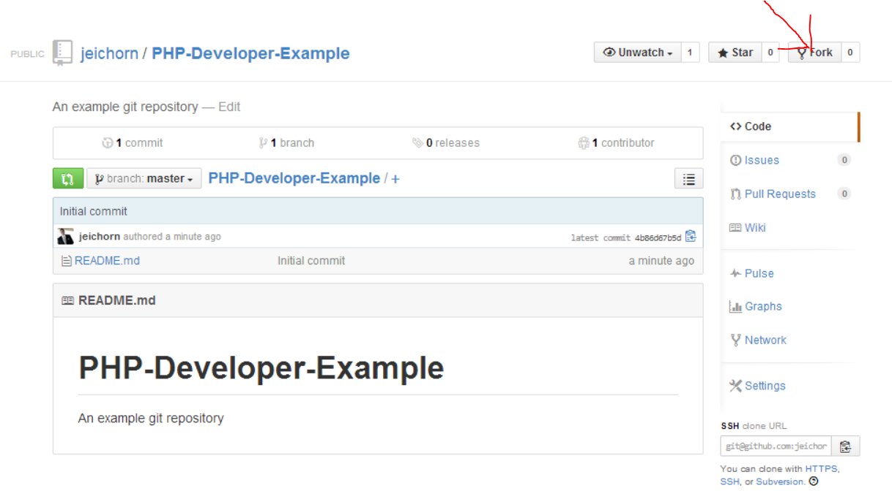
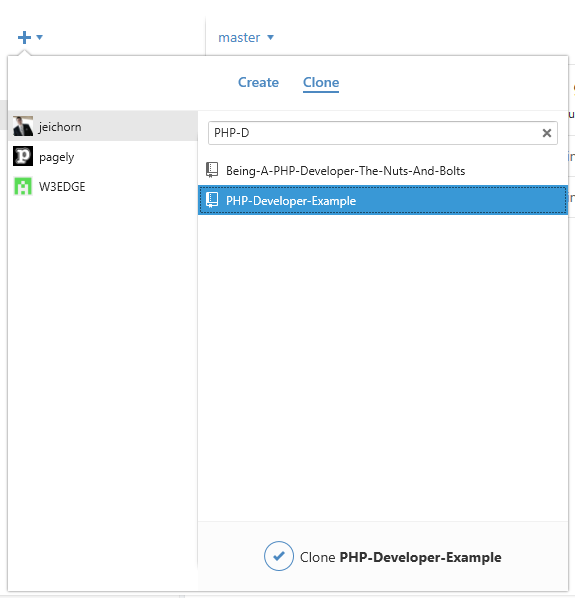
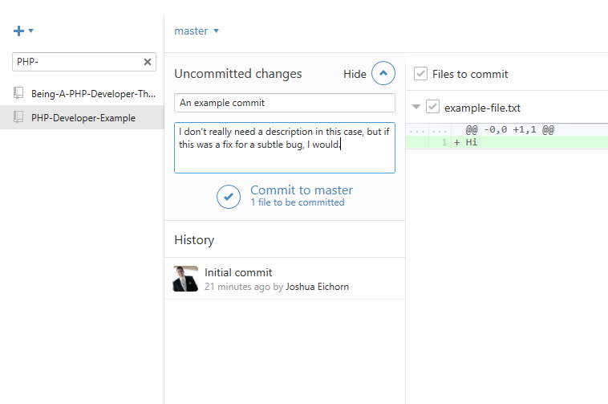

# Getting started with Git, Github Version

Github makes it easy to get started with Git.  The easiest thing to do is install the Gui client, it includes all the needed dependencies (which can be a hassle on windows) and gets you up and running in minutes.

## Create an account
First [create an account](https://github.com/), while following this tutorial you will be creating a public project so a free account works.  If you want to create private projects costs start at $7 a month. I find thats a reasonable price to pay for redudant infrasructure and backups, if thats more then you are willing to pay, [Bitbucket](https://bitbucket.org/plans) offers private repos for free.

## Install the Client
* Windows: https://windows.github.com/
* Mac: https://mac.github.com/

## Create a repository
You can follow along in two ways with this tutorial.  You can create a new empty repo, or you can fork the example repository.  The example repository includes some PHP code that is used in later tutorials.

### Create

### Fork
https://github.com/jeichorn/PHP-Developer-Example

## Clone repository

Once you have the repo cloned you open the directory in your favorite and add a test file.  Once that is done return to the github client and we can make our first commit.

From the client, show the uncommited changes, and write a commit message.

**Commit messages** are one of the most important parts of source control, they tell you what you were thinking 6 months down the line when you are fixing a bug.  Write a couple word title, and if the change needs it a larger description.  Note that you can decide what files go in the commit, use this power.

Git offers a lot more options to make a useful history, including [rewriting it](https://www.atlassian.com/git/tutorial/rewriting-git-history).  Ammend commits is especially useful and something you want to use.

## Syncing

Head over to https://github.com/ and check your repository out.  You won't see your commit.  Your local machine has a copy of the github repo, and right now the changes are only in it.  This allows for disconnected operation, and gives you lots of flexibility.  It also means if you want your changes to show up on github, you need to push your changes to the repoistory living at github.  In the client hit the sync button in the right corner.

The gui client combines pushing changes and pulling them.  The command line client keeps these as seperate concepts.

## Helpful tips

* You can edit files and make commits on the github website
* Checkout [git-flow](https://github.com/nvie/gitflow), it gives you a powerful workflow
* Don't like gui's checkout [hub](https://hub.github.com/) it lets you use many additional github features from the cli

## CLI
The command line Git client is great too, its what I use every day.  You will likely be using some basic cli commands in the future so its worth learning.  Right clicking on a repository will give you an option for a Git shell, the basic commands are covered in the [Atlassian tutorial](https://www.atlassian.com/git/tutorial/git-basics).
